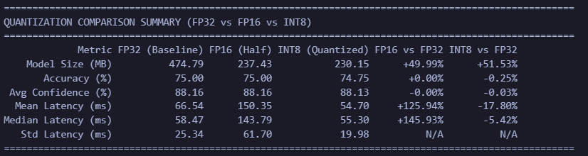
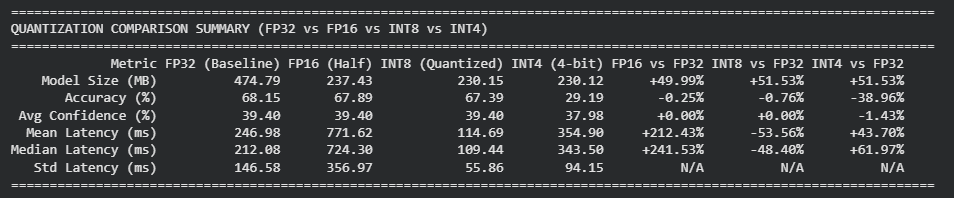
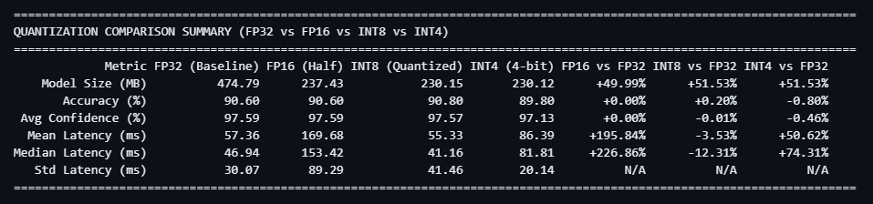
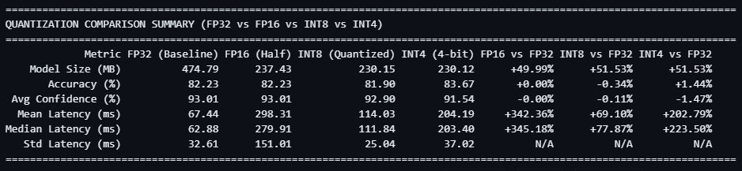

# Metode Quantization

- torch.quantization.quantize_dynamic -> cpu only yang versi ringan
- model_8bit = AutoModelForSequenceClassification.from_pretrained(
    model_id,
    load_in_8bit=True,
    device_map="auto"
) -> GPU

Dynammic PTQ udah cukup karna fokus researchnya gimana quantization ngaruh ke bobot internal modelnya dan performancenya bukan optimisasi spesifik deployment

### Testcase masih hardcode, masih pake model yang kecil, belum di finetuning

- researchnya bisa di bilang bestnya sih int8, latencynya paling gg dan akurasinya juga masih bagus.
- fp16 malah kurang dibagian latency (malah makin lama). ini pas di browsing dapatnya mungkin karna hardware issue karna most of cpu itu ga bisa itung langsung fp16 tapi flownya fp16 -> convert ke fp32 -> hitung -> convert balik makanya maybe itu yang bikin agak lama (NVIDIA GPU (Tensor Cores) bisa langsung itung fp16)

## Testcase dari dataset tweets INA 
788 Sample (1/30 dari datasets)
dengan config

- num_inference_runs = 1
- warmup_runs = 5

* INT8 ada pengurangan accuracy tapi latency lebih cepat
* FP32 masih konsisten tapi dia lama banget, plus nya ukurannya kecil (hampir sama kayak int8)

Kesimpulan :
* FP32 -> normal
* FP16 -> ukuran lebih kecil, akurasi sama, latency lebih lama
* INT8 -> ukuran lebih kecil (kurang dikit dari ukuran FP16), akurasi sedikit turun, latency lebih cepat

## Ganti model ke indobert base (standard) + INT4
788 Sample (1/30 dari datasets)
dengan config

- num_inference_runs = 1
- warmup_runs = 5

inferencenya bakalan tetap 1 karna bakalan lama banget predictnya, jadinya hasil latency jangan dilihat karna gabakalan akurat. 

Ignore aja kenapa accuracynya rendah karna disini kita fokusnya perbedaan FP32 dengan hasil quantize

Kesimpulan : 
* INT4 ternyata drop banget akurasinya, ga worth it dengan yang lain. masih bakalan lebih bagus dengan INT8 doang
* INT4 sepertinya harus di train ulang atau di finetune ulang, nah ini bakalan menjadi QAT bukan PTQ lagi, jadi PTQ gabakaln relevan untuk quantize ke INT4 karna pasti 100% bakaaln meledak 

# CHECKPOINT 
* FP16 -> cuman kecilin model, bisa lebih lama dari yang fp32 kalau masalah latency
* INT8 -> kecilin model, lebih cepat, tapi akurasinya bisa kurang dikit
* INT4 -> akurasinya bisa drop banget, jadinya ga worth it untuk dipake

## Finetuned Model + test.tsv datasets
* inference = 20 
* warmup = 5
* sample total = 500 

* somehow int8 lebih tinggi 0.20 dibandingkan fp32 sama fp16, berbeda dengan hasil eksseriment sebelumnya
* int4 tetap turun untuk accuracynya, masih sama seperti sebelumnya
* latencynya int 8 tercepat dibandingkan yang lain (expectnya sih int4 yang paling cepat tapi ternyata engga), tapi latency yang paling konsisten itu latency punya int4, tetapi tetap lama daripada int8
* jadinya muncul pertanyaan kneapa int8 bisa lebih tinggi daripada fp32 

| kenapa int8 bisa lebih tinggi daripada fp32, fp16 sedangkan int4 lebih rendah daripada int8 ?

## Finetuned Model + Tweet datasets
* inference = 2
* warmup = 5
* sample total = 1182 (1 banding 20)

* int4 accuracynya paling tinggi dibandingkan ketiga itu
* fp32, fp16, int8 masih konsisten dengan alur selama eksperimen (kecuali finetuned yang sebelumya dengan datatset test.tsv)

| kenapa int4 bisa lebih tinggi accuracynya dibandingkan yang lain?