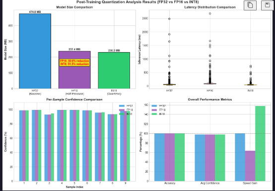

Metode Quantization 
 - torch.quantization.quantize_dynamic -> cpu only yang versi ringan 
 - model_8bit = AutoModelForSequenceClassification.from_pretrained(
    model_id,
    load_in_8bit=True,     
    device_map="auto"     
) -> GPU

Dynammic PTQ udah cukup karna fokus researchnya gimana quantization ngaruh ke bobot internal modelnya dan performancenya bukan optimisasi spesifik deployment

| (testcase masih hardcode, masih pake model yang kecil, belum di finetuning) |
- researchnya bisa di bilang bestnya sih int8, latencynya paling gg dan akurasinya juga masih bagus. 
- fp16 malah kurang dibagian latency (malah makin lama). ini pas di browsing dapatnya mungkin karna hardware issue karna most of cpu itu ga bisa itung langsung fp16 tapi flownya fp16 -> convert ke fp32 -> hitung -> convert balik makanya maybe itu yang bikin agak lama

| (testcase dari dataset tweets INA) | 

