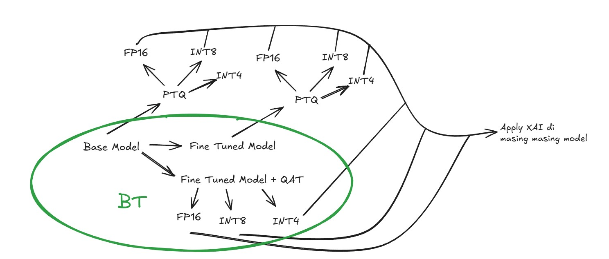
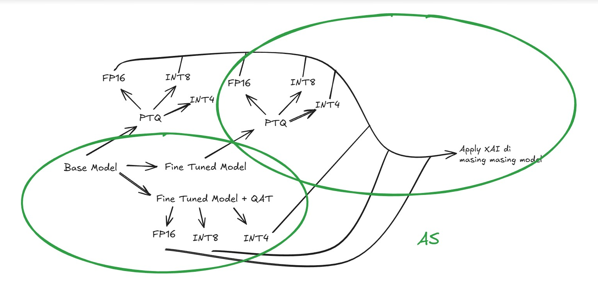
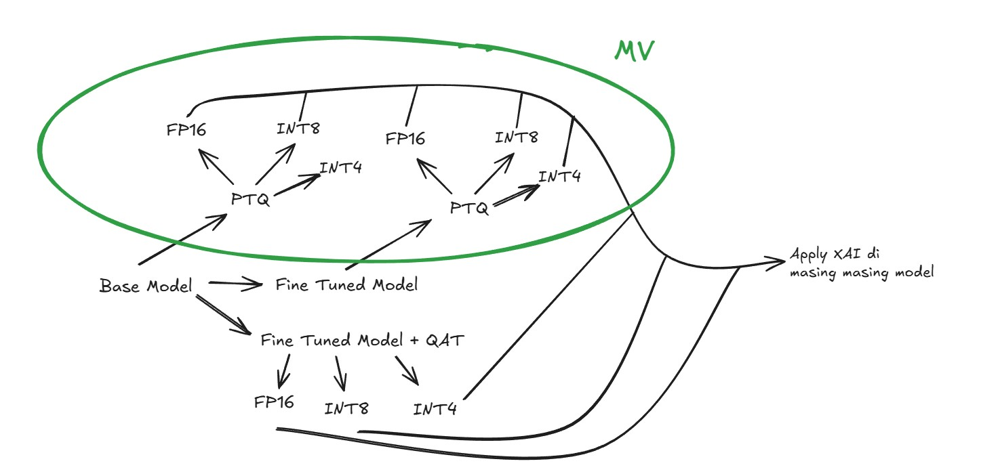

- lanjutin progress
- arxiv itu temporary doang -> jadi intinya blm verified, mesti cari scholar
- bkin artikel utk web socs? terutama utk topik "Quantization" dengan bhs manusiawi# Progress 13 Feb 2026
## Roadmap

## Task 

### Bertrand

### Helena

### Collin

## Finetune Model
* dataset : SMSA IndoNLU
* model : indobert-base-p2
* EDA : 
    * Load dataset dari SMSA IndoNLU (train, validation, test split)
    * Analisis distribusi dataset split: Train (11.324 samples), Validation (1.261 samples), Test (1.263 samples)
    
    

    
    * Visualisasi distribusi sentimen label menggunakan pie chart dan bar chart
    
    
    
    

    * Perbandingan distribusi sentimen antara train dan validation set untuk memastikan balance    
    * Handling missing values dan cleaning data pada training set
    * Analisis panjang teks: statistik (mean, median, std dev, min, max) untuk setiap split

    

    * Visualisasi distribusi panjang teks menggunakan histogram dan boxplot untuk train, validation, dan test set
    
    
    
    
    * Analisis panjang teks berdasarkan kategori sentimen
    
    

    
    * N-gram analysis: analisis bigram dan unigram yang paling sering muncul
   
    
    
    
    
    * Analisis top words per kategori sentimen untuk memahami karakteristik tiap kelas
    
    

* pipeline : 
    * Load tokenizer dari indobenchmark/indobert-base-p2
    * Load dataset SMSA (train.tsv, valid.tsv, test.tsv)
    * Mapping label text ke numeric values:
        * positive → 0
        * neutral → 1
        * negative → 2
    * Text preprocessing:
        * Convert text ke lowercase
        * Remove karakter non-alphabetic (hanya simpan huruf dan spasi)
        * Remove extra whitespace
        * Remove Indonesian stopwords menggunakan library Sastrawi
    * Tokenization dengan max_length=128, truncation=True, padding="max_length"
    * Load model FP32 IndoBERT base dengan 3 label classification
    * Setup training arguments:
        * Learning rate: 2e-5
        * Batch size: 16 (train & eval)
        * Epochs: 3
        * Precision: FP32
        * Optimizer: AdamW dengan weight_decay=0.01
        * Evaluation & save strategy: per epoch
        * Metric for best model: F1 score
    * Initialize Trainer dengan compute_metrics (accuracy, precision, recall, f1)
    * Fine-tuning model pada train set dengan evaluasi pada validation set
    * Evaluate model pada test set dan hitung semua metrics
    * Generate confusion matrix untuk analisis per-class performance
    * Generate classification report (precision, recall, f1 per class)
    * Save fine-tuned model dan tokenizer
 
    source paper for finetuning:
    * [BERT: Pre-training of Deep Bidirectional Transformers for Language Understanding](https://arxiv.org/abs/1810.04805)

## PTQ Quantization
Detail about PTQ Quantization Notes [quantization-ptq.md](https://github.com/Wenfuuu/model-quantization-sentiment-analysis/blob/original/notes/quantization-ptq.md)

| NOTES : untuk tweets datasets latencynya gabakalan akurat karna inferencenya diset 1 (supaya ga lama makan waktu)

### Indobert Original + Tweets Dataset
* FP16 cuman kecilin size, ini walaupun ga akurat tapi latencynya paling lama
* INT8 kecilin size, tapi accuracy turun dikit
* INT4 kecilin size sama aja seperti yang lain, accuracy turun drastis

| INT8 masih menjadi the best quantization dan paling worth it

### Original + Clean Datasets
* INT8 lebih tinggi accuracy 0.20 daripada yang lain (harus dipastikan kenapa)
* sisanya sesuai ekspektasi  

| INT8 masih menjadi top

### Indobert Finetuned + Clean Datasets
* int8 malah lebih tinggi 0.20 accuracynya (which is bagus tapi too good to be true) ini masih harus di findout kenapa bisa naik yang harusnya turun. based on experiment siklusnya mungkin karna datasets clean
* int4 lebih stabil turun dikit, tapi latencynya masih lebih lama daripada int8

| INT8 masih menjadi top

### Indobert Finetuned + Tweets Datasets
* dari teori yang kita buat kenapa int8 naik dikit kalau dipakein tweets datasets itu malah normal seperti ekspektasi yaitu turun sedikit
* tapi ada funfact baru dimana int4 malah naik dari 82.23 (FP32) -> 83.68 (INT4). 
* sisanya masih sama hasilnya sesuai yang diatas biasanya

| INT 4 menjadi top disini, tapi mungkin fake karna kebetulan aja?

| dari paper PTQ vs QAT harusnya PTQ INT8 yang jadi top karna PTQ INT4 bakalan mengalami akurasi yang turun (dalam konteks dipapernya ga dibilang ptq nya ini udah di finetuned atau belum jadinya anggap masih original model)

### RECAP PTQ Quantization
* INT8 selalu yang paling menjadi stabil dibandingkan yang lain dimana kecilin model size selalu works, accuracy ga gimana beda jauh dan lebih stabil
* Problem : 
    * Kenapa tiap kali pakai clean datasets dibagian INT8 nya selalu naik 0.20 ?
    * Kenapa yang finetuned + tweets datasets INT4 accuracynya bisa naik sedangkan berdasarkan experiment INT4 harusnya paling kecil accuracynya atau anjlok ? 
    
    | ANSWER : 
    * Regularization Effect -> Quantization bikin bobot jadi lebih kasar -> model jadi kurang overfit -> generalisasi naik
    * Dataset Clean = Noisenya rendah -> jadi mudah diprediksi (jadinya mungkin karna dataset karna tiap kali pake dataset clean dia selalu naik 0.20 di bagian INT8nya)
    * Kalau dari paper PTQ vs QAT, INT4 gabisa dianggap beneran bagus karna dia itu terlalu aggresif apa lagi untuk bagian PTQ sudah pasti gagal  

## PTQ vs QAT 
Based on paper 
[click here](https://github.com/Wenfuuu/model-quantization-sentiment-analysis/blob/original/notes/ptq-vs-qat.md)

## QAT Quantization

* Pendekatan : Quantization-Aware Training (QAT) menggunakan PyTorch dengan fake quantization
* Model : IndoBERT fine-tuned pada SMSA dataset
* Target : INT8 quantization
* Pipeline : 
  - Load finetuned FP32 model
  - Prepare model untuk QAT menggunakan `torch.quantization.prepare_qat()`
  - Training ulang model dengan fake quantization nodes:
    - Simulates quantization effects during training
    - Model learns to be robust terhadap quantization errors
    - Weights dan activations di-quantize ke INT8 range selama forward pass
  - Freeze quantization observers sebelum evaluation
  - Convert model ke quantized version menggunakan `torch.quantization.convert()`
  - Evaluate performance (accuracy, latency, model size)

* Test Configuration :
  - 500 samples dari test set
  - 5 warmup runs
  - 20 inference runs per sample untuk measure latency

* Hasil Perbandingan FP32 vs FP16 vs INT8 QAT :

  

* Findings :
  - **Accuracy meningkat** dari 87.60% (FP32) → 88.60% (INT8 QAT) (+1.00%)
    - QAT approach membantu model learn robust representations
    - Training dengan quantization noise bertindak sebagai regularization
  - **Model size tidak mengecil** - masih ~475 MB (seharusnya ~120 MB untuk true INT8)
  - **Latency tidak berkurang** - masih ~4.2 ms (seharusnya lebih cepat untuk INT8)

* Problem yang ditemukan :
  - **PyTorch fake quantization** hanya mensimulasikan quantization effect selama training
  - Model masih tersimpan dalam **FP32 format** setelah conversion
  - PyTorch `torch.quantization.convert()` **tidak fully support** untuk convert ke true INT8 binary format
  - Tidak ada actual compression atau speedup yang terjadi
  - Weights masih menggunakan 32-bit representation, hanya dengan quantized values

* Next Steps (Work in Progress) :
  - Research methods untuk convert PyTorch QAT model ke **true INT8 format**
  - Eksplorasi konversi model ke **ONNX format**:
    - ONNX Runtime supports true INT8 quantization
    - Dapat menggunakan `torch.onnx.export()` untuk convert PyTorch model
    - Apply ONNX quantization tools untuk actual INT8 conversion
  - Goal: Achieve actual model compression (~4x size reduction) dan inference speedup dengan maintain accuracy

## Hybrid Quantization

## XAI 