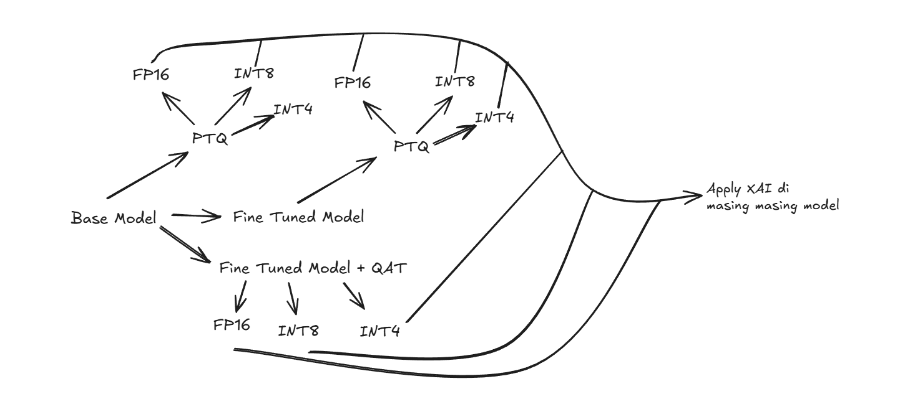

# Progress 13 Feb 2026
## Roadmap

## Finetune Model
* dataset : 
* model : 
* etc.. : 

isi gmn lu finetune modelnya bet

## PTQ Quantization
Detail about PTQ Quantization Notes [quantization-ptq.md](https://github.com/Wenfuuu/model-quantization-sentiment-analysis/blob/original/notes/quantization-ptq.md)

| NOTES : untuk tweets datasets latencynya gabakalan akurat karna inferencenya diset 1 (supaya ga lama makan waktu)

### Indobert Original + Tweets Dataset
* FP16 cuman kecilin size, ini walaupun ga akurat tapi latencynya paling lama
* INT8 kecilin size, tapi accuracy turun dikit
* INT4 kecilin size sama aja seperti yang lain, accuracy turun drastis

| INT8 masih menjadi the best quantization dan paling worth it

### Original + Clean Datasets
* INT8 lebih tinggi accuracy 0.20 daripada yang lain (harus dipastikan kenapa)
* sisanya sesuai ekspektasi  

| INT8 masih menjadi top

### Indobert Finetuned + Clean Datasets
* int8 malah lebih tinggi 0.20 accuracynya (which is bagus tapi too good to be true) ini masih harus di findout kenapa bisa naik yang harusnya turun. based on experiment siklusnya mungkin karna datasets clean
* int4 lebih stabil turun dikit, tapi latencynya masih lebih lama daripada int8

| INT8 masih menjadi top

### Indobert Finetuned + Tweets Datasets
* dari teori yang kita buat kenapa int8 naik dikit kalau dipakein tweets datasets itu malah normal seperti ekspektasi yaitu turun sedikit
* tapi ada funfact baru dimana int4 malah naik dari 82.23 (FP32) -> 83.68 (INT4). 
* sisanya masih sama hasilnya sesuai yang diatas biasanya

| INT 4 menjadi top disini, tapi mungkin fake karna kebetulan aja?

| dari paper PTQ vs QAT harusnya PTQ INT8 yang jadi top karna PTQ INT4 bakalan mengalami akurasi yang turun (dalam konteks dipapernya ga dibilang ptq nya ini udah di finetuned atau belum jadinya anggap masih original model)

### RECAP PTQ Quantization
* INT8 selalu yang paling menjadi stabil dibandingkan yang lain dimana kecilin model size selalu works, accuracy ga gimana beda jauh dan lebih stabil
* Problem : 
    * Kenapa tiap kali pakai clean datasets dibagian INT8 nya selalu naik 0.20 ?
    * Kenapa yang finetuned + tweets datasets INT4 accuracynya bisa naik sedangkan berdasarkan experiment INT4 harusnya paling kecil accuracynya atau anjlok ? 
    
    | ANSWER : 
    * Regularization Effect -> Quantization bikin bobot jadi lebih kasar -> model jadi kurang overfit -> generalisasi naik
    * Dataset Clean = Noisenya rendah -> jadi mudah diprediksi (jadinya mungkin karna dataset karna tiap kali pake dataset clean dia selalu naik 0.20 di bagian INT8nya)
    * Kalau dari paper PTQ vs QAT, INT4 gabisa dianggap beneran bagus karna dia itu terlalu aggresif apa lagi untuk bagian PTQ sudah pasti gagal  

## PTQ vs QAT 
Based on paper 
[click here](https://github.com/Wenfuuu/model-quantization-sentiment-analysis/blob/original/notes/ptq-vs-qat.md)

## QAT Quantization

## Hybrid Quantization

## XAI 