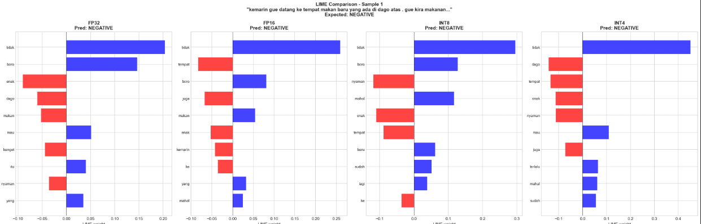

* artikel ilmiah [docs](https://docs.google.com/document/d/1MWhUUqAWDfh2ZaJQGqgGcGUQJ-H12Mg_2pc8TV-PqsY/edit?tab=t.0#heading=h.kr5pglct0lar)
* overleaf [text](https://www.overleaf.com/project/6981d36d4cafd26c9f1fd9a7)
* structure project with ptq and xai

## Contoh Lime

## QAT with ONNX

### Problem dari QAT Sebelumnya (PyTorch Fake Quantization)

Dari experiment QAT sebelumnya menggunakan PyTorch fake quantization, ditemukan masalah kritis:
- Model size tidak berkurang (masih ~475 MB, seharusnya ~120 MB untuk true INT8)
- Latency tidak berkurang (masih ~4.2 ms, tidak ada speedup)
- Fake quantization hanya mensimulasikan quantization effect selama training
- Model tetap tersimpan dalam FP32 format setelah conversion
- Hanya memberikan accuracy improvement (+1.00%) tanpa compression atau speedup benefits

### Solusi: QAT + ONNX Conversion Pipeline

Dikembangkan pipeline baru untuk mendapatkan **TRUE INT8 quantization**:
1. QAT Training (PyTorch) → train dengan fake quantization
2. ONNX Export → export weights ke ONNX format
3. Dynamic INT8 Quantization (ONNX Runtime) → convert weights FP32 → INT8
4. Inference (ONNX Runtime) → deploy dengan true quantized model

### Hasil Experiment: GPU vs CPU Deployment

**GPU Deployment (CUDA):**

**Findings GPU:**
- ✅ Model size compression: 475 MB → 119.53 MB (-74.82%, **4x compression achieved!**)
- ✅ Accuracy maintained: FP32 87.60% → INT8 86.40% (only -1.20% drop)
- ❌ **Latency SLOWER**: FP32 3.89 ms → INT8 19.92 ms (+411.79%)
  - **Kenapa lambat?** GPU tidak bisa langsung memproses INT8 untuk model transformer
  - Data harus **bolak-balik antara CPU dan GPU** (186 kali vs FP32 hanya 12 kali)
  - Kesimpulan: INT8 di GPU malah **lebih lambat 5x** karena overhead perpindahan data

**CPU Deployment:**

**Findings CPU:**
- ✅ Model size compression: 475 MB → 119.53 MB (-74.82%, **4x compression**)
- ✅ Accuracy maintained: FP32 87.60% → INT8 86.40% (-1.20%)
- ✅ **Latency FASTER**: FP32 74.32 ms → INT8 31.37 ms (-57.80%, **2.37x speedup!**)
- ✅ More stable inference: Std latency 0.04 ms (lowest)

### Problems & Limitations

1. **FP16 ONNX Compatibility Issues ❌**
   - FP16 conversion menghasilkan type mismatch errors: `tensor(float16)` vs `tensor(float)`
   - ONNX Runtime tidak fully support FP16 untuk transformer models
   - Solution: Skip FP16, langsung ke INT8 atau gunakan FP32

2. **INT8 on GPU Performance ❌**
   - INT8 ONNX 5x lebih lambat di GPU dibanding FP32
   - 186 Memcpy nodes = CPU↔GPU transfer overhead
   - CUDA tidak memiliki native INT8 support untuk transformers

3. **Hardware-Specific Behavior**
   - INT8 benefits hanya terlihat di CPU
   - GPU optimized untuk FP32/FP16, bukan INT8
   - Deployment strategy bergantung pada target hardware

### RECAP QAT + ONNX

**Before (PyTorch Fake QAT):**
- Model size: 475 MB (NO COMPRESSION)
- Latency: 4.20 ms (NO SPEEDUP)
- Accuracy: 88.60%
- Problem: Hanya simulasi, tidak ada true quantization

**After (QAT + ONNX INT8 on CPU):**
- Model size: 119 MB (**4x compression** ✅)
- Latency: 31.37 ms (**2.37x speedup** ✅)
- Accuracy: 86.40% (minimal -1.20% drop)
- Result: **TRUE INT8 quantization** dengan real benefits

| INT8 ONNX pipeline berhasil achieve TRUE quantization benefits, production-ready untuk CPU deployment
